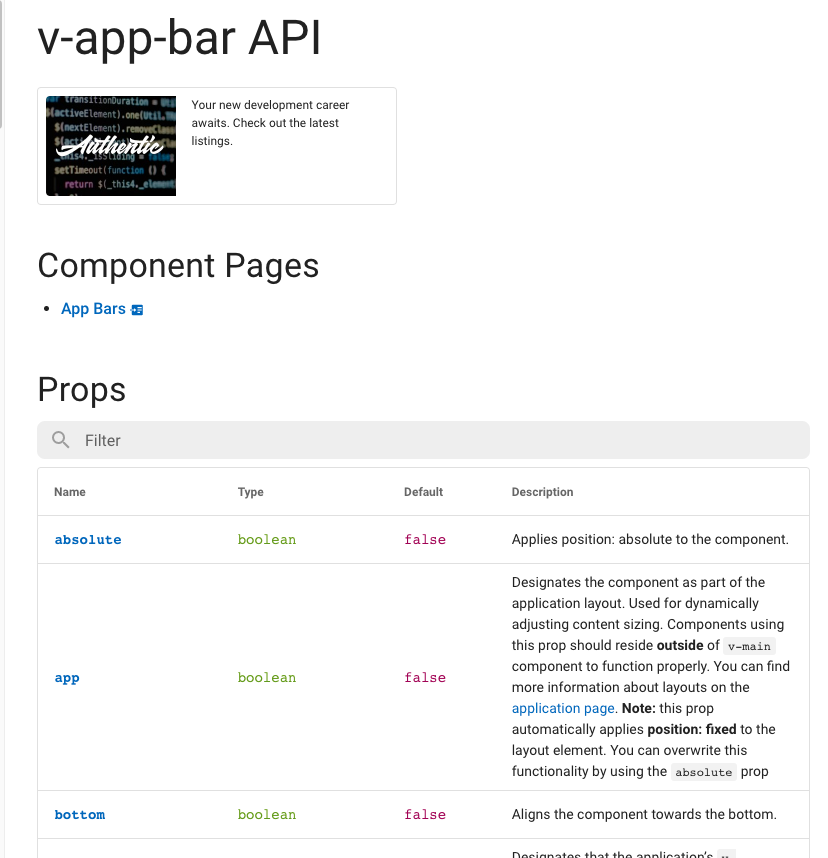

# Vue Project Quick Start

1. Create project folder
2. Open the project in VSCode
3. In Command Pallete, add a develoment container with existing setup: Vue with node
4. Reopen the folder in Remote Container: first time it will create a container with Vue alredy installed
5. Open a terminal and create a new project:
```bash
vue create .
```
6. Choose the desired presets
7. Spin the welcome page

### Install Vuetify
```
vue add vuetify
```
Notice the v-tags in the project, they are part of Vuetify API.

### Vuetify UI Documentation

#### PROPS: They are attributes that are exposed to accept data from the parent component.



```html
<v-app-bar app>
```


#### Project setup after cloning from git
```
yarn install
```
#### Compiles and hot-reloads for development
```
yarn serve
```
#### Compiles and minifies for production
```
yarn build
```
#### Lints and fixes files
```
yarn lint
```
#### Customize configuration
See [Configuration Reference](https://cli.vuejs.org/config/).
