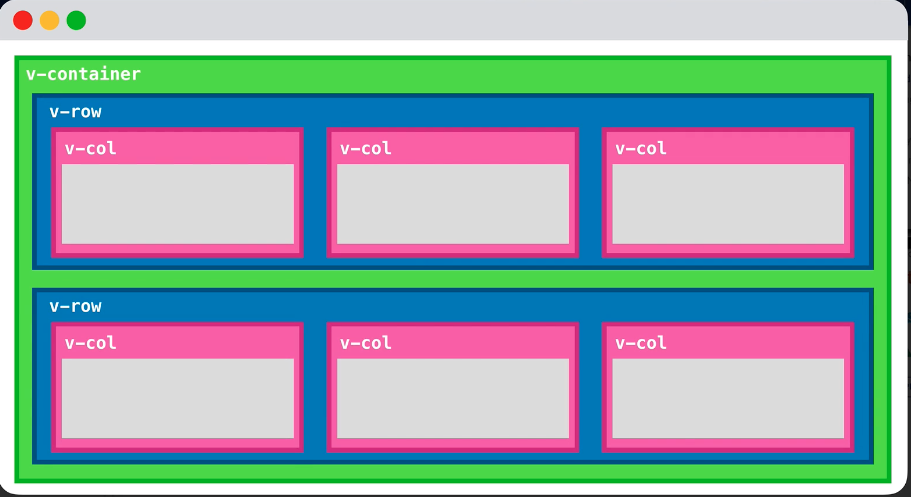
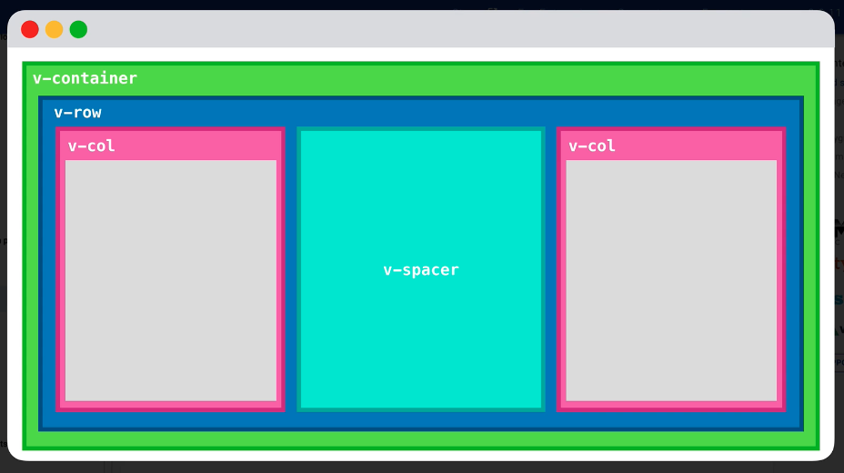
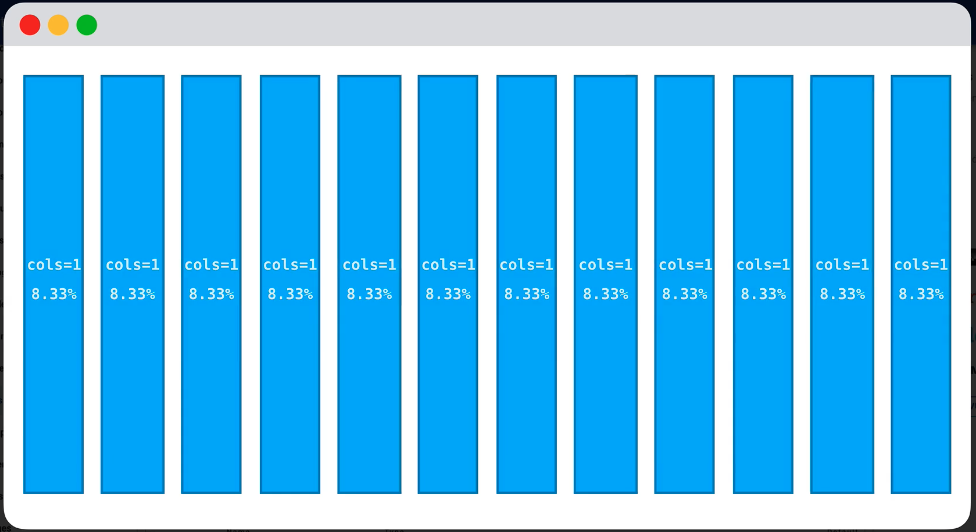
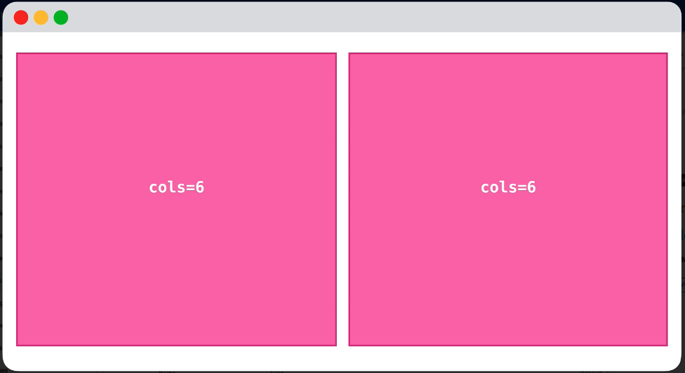

# Vue Project Quick Start

1. Create project folder
2. Open the project in VSCode
3. In Command Pallete, add a develoment container with existing setup: Vue with node
4. Reopen the folder in Remote Container: first time it will create a container with Vue alredy installed
5. Open a terminal and create a new project:
```bash
vue create .
```
6. Choose the desired presets
7. Spin the welcome page

### Install Vuetify
```
vue add vuetify
```
Notice the v-tags in the project, they are part of Vuetify API.

### Vuetify UI Documentation

#### PROPS: They are attributes that are exposed to accept data from the parent component.


```html
<v-app-bar app>
```

Vuetify’s Grid System
The primary foundation for layout with Vuetify is its grid system. Inspired by Bootstrap’s grid system, Vuetify’s grid system is built with flexbox and consists of four primary components:

* **Container (v-container)** - This is the base wrapper for creating any grid layout on your page. By default, it will provide default max-width behavior to ensure your content is accessible at larger device sizes
* **Row (v-row)** - This is the wrapper component around columns and should be a direct child of v-container
* **Column (v-col)** - The wrapper around content, which must be a direct child of v-row
* **Spacer (v-spacer)** - A useful component for filling available space or making space between two components







These comprise of the fundamental building blocks for laying out and aligning content on the page.

### Install Vue Router
In order to start navigating through pages, it is time to install a router.
```
vue add router
```
Don't panic if the installation changes the code, due to boiler plate automatic confir. Use your Version control to discard those changes.


### Customize configuration
See [Configuration Reference](https://cli.vuejs.org/config/).
